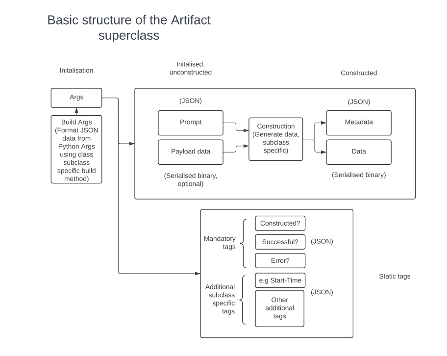

# ArtifactForge

ArtifactForge is a flexible and extensible library for creating and managing various types of artifacts, with a focus on media-related functionalities.



## Table of Contents

1. [Base Structure](#base-structure)
2. [Mixin Logic](#mixin-logic)
3. [Concrete Artifacts](#concrete-artifacts)
4. [Combined Artifacts](#combined-artifacts)
5. [JSON Formatting](#json-formatting)
6. [How This Structure Works](#how-this-structure-works)
7. [Maintaining the Structure](#maintaining-the-structure)
8. [Usage Examples](#usage-examples)

## Base Structure

- The `Artifact` class is the foundation, providing a common interface for all artifacts.
- It has an abstract `build` method, ensuring all subclasses implement their own construction logic.
- The `__init__` method accepts a prompt directly, allowing for pre-formatted JSON inputs.

```python
from abc import ABC, abstractmethod
import json

class Artifact(ABC):
    def __init__(self, prompt, serialized_data=None, constructed=False, **kwargs):
        self.prompt = prompt
        self.mandatory_tags = {}
        self.optional_tags = {}
        self.serialized_data = serialized_data
        self.constructed = constructed
        self._data = None
        
        for key, value in kwargs.items():
            self.optional_tags[key] = value

    @classmethod
    @abstractmethod
    def build(cls, prompt, **kwargs):
        formatted_prompt = json.dumps({"prompt": prompt})
        return cls(formatted_prompt, **kwargs)

    # Other methods...

```

Concrete Artifacts

- Concrete artifacts are simple artifact implementations. They inherit only from the artifact superclass. An example, like NarrationArtifact implement their specific build methods and generation logic.
- They can add their own optional tags or other specific functionality.

```python
class NarrationArtifact(Artifact):
    @classmethod
    def build(cls, prompt, voice_id=None, **kwargs):
        formatted_prompt = json.dumps({"prompt": prompt})
        instance = cls(formatted_prompt, **kwargs)
        if voice_id:
            instance.optional_tags['voice_id'] = voice_id
        return instance

    # Other methods...
```

Mixin Logic

The MediaMixin adds media-specific attributes (start_time and end_time) to artifacts.
It provides its own build method that includes these media-specific parameters.
This mixin can be applied to any artifact that needs media functionality.
Mixin Logic

- Mixins are used to add additional functionality to artifacts
- The MediaMixin adds media-specific attributes (start_time and end_time) to artifacts.
- It provides its own build method that includes these media-specific parameters.
- This mixin can be applied to any artifact that needs media functionality.

```python

class MediaMixin:
    def __init__(self, *args, start_time, end_time, **kwargs):
        super().__init__(*args, **kwargs)
        self.mandatory_tags['start_time'] = start_time
        self.mandatory_tags['end_time'] = end_time

    @classmethod
    def build(cls, prompt, start_time, end_time, **kwargs):
        formatted_prompt = json.dumps({"prompt": prompt})
        return cls(formatted_prompt, start_time=start_time, end_time=end_time, **kwargs)

    # Other methods...

```

Combined Artifacts

- Classes like MediaNarrationArtifact below combine a concrete artifact with the MediaMixin.
- They inherit the build method from the mixin, which includes media-specific parameters.
- This build method can be overridden to add additional functionality.

```python
class MediaNarrationArtifact(MediaMixin, NarrationArtifact):
    pass
```

# JSON Formatting 
- JSON formatting of the prompt happens in the build methods, not in __init__.
- This allows for flexibility in how prompts are input and formatted.

## How This Structure Works

- The build methods act as constructors, formatting the JSON and setting up the artifact.
- The __init__ methods handle the actual initialization of the object.
- Mixins add functionality that can be easily combined with different artifacts.
- Python's method resolution order (MRO) ensures that the mixin's build method is called first in combined classes.

## Maintaining the Structure

- When creating new artifacts, subclass Artifact and implement the build method.
- For new functionality that could apply to multiple artifacts, create a new mixin.
- To combine functionalities, create a new class that inherits from the desired mixin(s) and concrete artifact class.
- Always implement JSON formatting in the build methods, not in __init__.
- Use mixins to add required arguments (like start_time and end_time for media artifacts).
- Keep the __init__ method flexible to accept pre-formatted inputs when needed.

## Usage Examples
## Creating a Simple Artifact
```python
class SimpleArtifact(Artifact):
    @classmethod
    def build(cls, prompt, **kwargs):
        formatted_prompt = json.dumps({"prompt": prompt})
        return cls(formatted_prompt, **kwargs)

    def generate_data(self, prompt):
        # Implementation for generating simple data
        return f"Generated data for: {prompt}"
```
# Usage

```python
simple_artifact = SimpleArtifact.build("This is a simple prompt")
simple_artifact.construct()
print(simple_artifact.data)
```